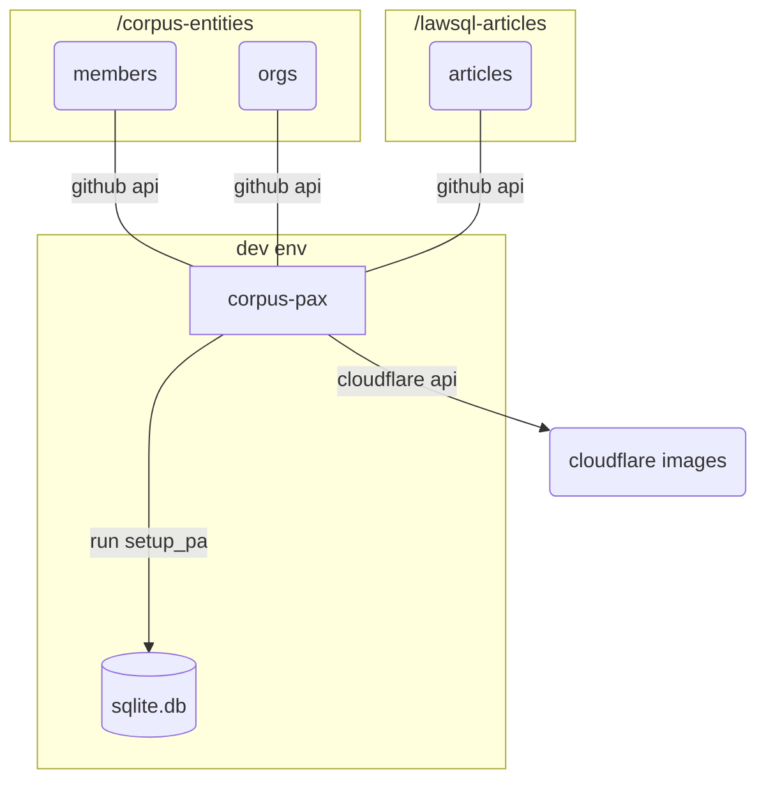

---
hide:
  - navigation
---
# Overview

Using a [sqlpyd](https://github.com/justmars/sqlpyd)-fashioned database, create tables for generic users, organizations, and articles, sourcing the data from Github repositories.



Each corpus entity in the `/corpus-entities` repository will contain 2 files: a `details.yaml` and an `avatar.jpeg`
organized according to the following structure:

```text
<gh-repo>/ # github repository
├─members/
    ├─<id-of-individual-1>/
    │ ├─details.yaml
    │ └─avatar.jpeg
    ├─<id-of-individual-2>/
    │ ├─details.yaml
    │ └─avatar.jpeg
|-orgs/
    ├─<id-of-org-1>/
    │ ├─details.yaml
    │ └─avatar.jpeg
    ├─<id-of-org-2>/
    │ ├─details.yaml
    │ └─avatar.jpeg
```

The `details.yaml` file should contain the key value pairs for the org represented by the id.

## Run

```py
>>> from corpus_pax import setup_pax
>>> setup_pax("x.db")
```

Since it's hard to correct the m2m tables, `setup_pax()` drops all the tables first, before adding content.

`setup_pax()` is a collection of 3 functions:

### Add individuals

::: corpus_pax.__main__.add_individuals_from_api

### Add organizations

::: corpus_pax.__main__.add_organizations_from_api

### Add articles

::: corpus_pax.__main__.add_articles_from_api

## Prerequisites

### Repositories

Different repositories involved:

repository | status | type | purpose
:--|:--:|:--:|:--
[lawsql-articles](https://github.com/justmars/lawsql-articles) | private | data source | used by _corpus-pax_; yaml-formatted member and org files
[corpus-entities](https://github.com/justmars/corpus-entities) | private | data source | used by _corpus-pax_; markdown-styled articles with frontmatter
[corpus-pax](https://github.com/justmars/corpus-pax) | public | sqlite i/o | functions to create pax-related tables

Since data concerning members will be pulled from such repositories, make sure the individual / org fields in resources match the data pulled from `corpus-entities`.

Each avatar image should be named `avatar.jpeg` so that these can be uploaded to Cloudflare.

### .env

Create an .env file to create/populate the database. See `sample .env` highlighting the following variables:

1. Cloudflare `CF_ACCT`
2. Cloudflare `CF_TOKEN`
3. Github `GH_TOKEN`
4. `DB_FILE` (sqlite)

Note the workflow (main.yml) where the secrets are included for Github actions. Ensure these are set in the repository's `<url-to-repo>/settings/secrets/actions`, making the proper replacements when the tokens for Cloudflare and Github expire.
